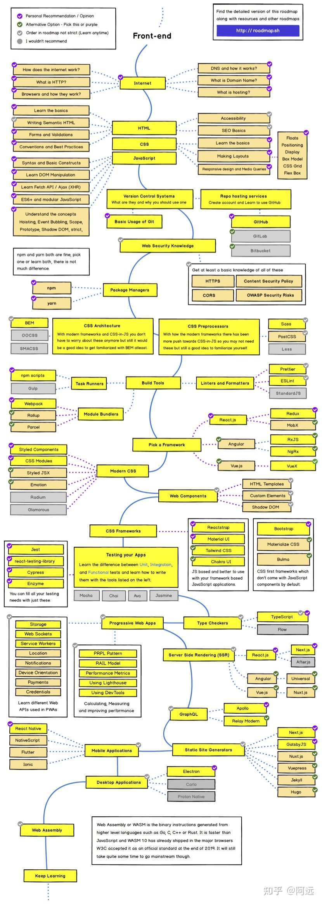

<!--  -->
# JavaScript learning guiding

## FrontEnd route

1. internet
   1. How does the internet works
   2. what is HTTP
   3. Browsers and how they work
   4. DNS and how it works
   5. what is Domain Name
   6. what is hosting
2. HTML
   1. basics
   2. Semantic HTML
   3. Forms and validations
   4. conventions and best practices
   5. accessibility
   6. SEO basics
3. css
   1. basics
   2. making layouts
   3. responsive design and media queries
4. javaScript
   1. syntax and basic constructs
   2. learn dom manipulation
   3. klearn Fetch API / ajax
   4. ES6 and modular java Script
   5. understand the concepts hoisting, event bubbling, scope,prototype,shadow dom ,strict
5. version control systems
   1. basic usage of git
   2. repo hosting services github
6. web security knowledge
   1. HTTPS/CORS/Content Security Policy/OWASP Security Risks
7. Package Managers
   1. npm
   2. yarn
8. CSS Architecture - BEM
9. CSS Preprocessor 
   1.  Sass
   2.  less
   3.  PostCss
10. Build Tools
    1.  taskRunners -npm scripts
    2.  moduleBundlers -webpack
11. Linters and Formatters
    1.  Prettier
    2.  ESLint
12. FrameWork
    1.  React
        1.  redux
    1.  Angular
    2.  vue
13. Modern CSS
    1.  Styled Components
    2.  CSS Modules
    3.  Styled JSX
    4.  Emotions
14. CSS FrameWorks
    1.  Material UI
15. Type Checkers typeScript
16. Prograssive web apps
    1.  storage
    2.  web sockets
    3.  service workers
    4.  credentials
    5.  locations
    6.  PRPL Pattern 
    7.  RAIL Model
    8.  Performance Metrics
    9.  Using LightHouse
    10. Using DevTools
17. Server Side Rendering (SSR)
    1.  reactjs(nextjs)
    2.  vuejs(nuxt.js)
18. GraphQL
    1.  Apollo
    2.  Relay Modern
19. Static Site Generators
    1.  Mextjs 
    2.  GatsbyJS
20. mobile applications
    1.  reactNative
    2.  NativeScript
    3.  Flutter
    4.  Ionic
21. Desktop Applications
    1.  Electron

